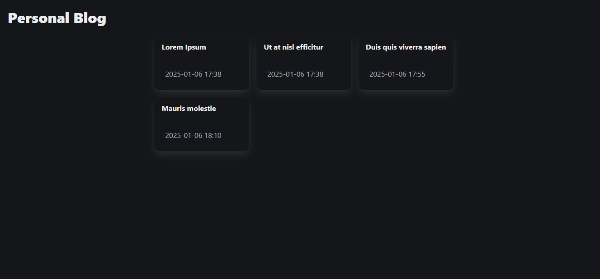
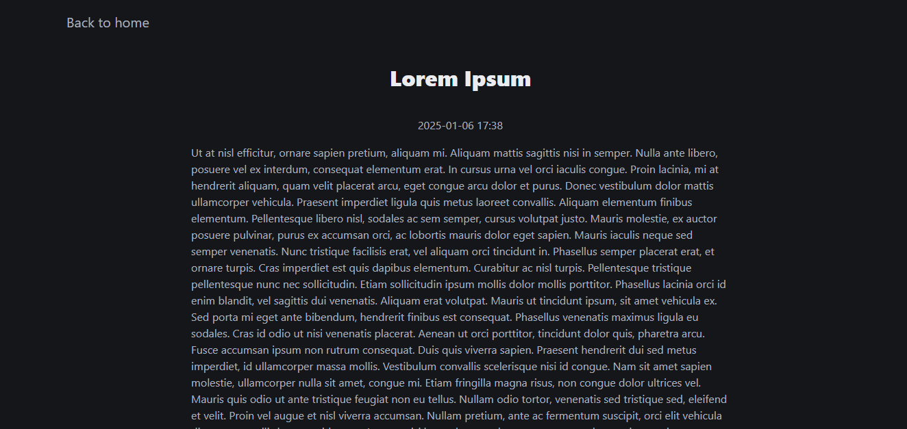
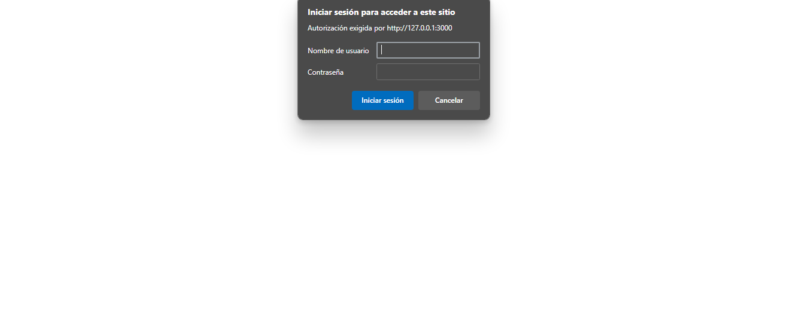
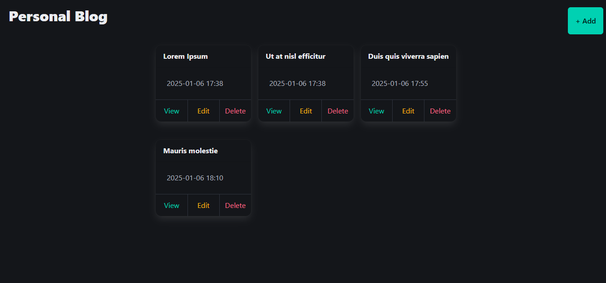
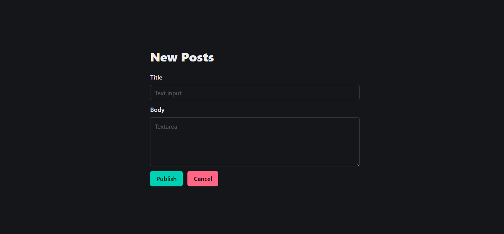
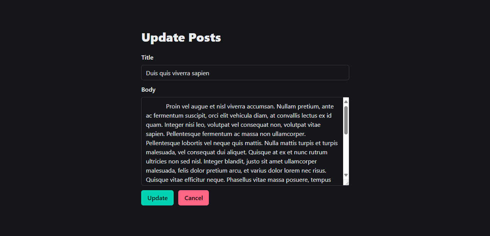

# Personal Blog

A personal blog is a digital space where you share your experiences, thoughts, interests, and passions. It can include topics like personal reflections, projects, hobbies, travels, opinions, or anything that inspires you, offering a unique and authentic touch that reflects your personality.

## Features

- Create, read, update, and delete posts
- Admin panel with authentication
- JSON-based data storage

## Getting Started

1. Clone the repository:
   ```bash
   git clone https://github.com/angellisandroerazo/personal-blog.git
   ```

2. Navigate to the project directory:
   ```bash
   cd personal-blog
   ```

3. Run the application:
   ```bash
   go run main.go
   ```
   The application will be available at http://127.0.0.1:3000 or http://localhost:3000

## Screenshots

<div>
  
  
  
</div>
<div>
  
  
  
</div>

# Problem Statement
This project addresses a task management problem inspired by the challenges outlined in the [Unit Converter ](https://roadmap.sh/projects/personal-blog).